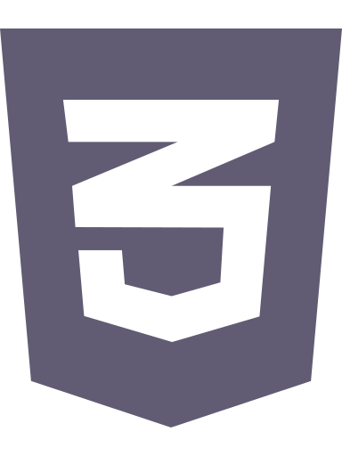
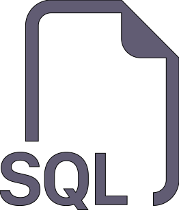
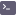
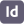

<h1 align="center">:seedling: Bienvenue sur mon GitHub :seedling:</h1>

    

    

<h2 align="center">À propos</h2>

:briefcase: En recherche d'emploi

:art: Parcourez mon 
    <a href="https://alinemasson.github.io/portfolio/", alt="alinemasson.github.io/portfolio/">portfolio</a>

:clipboard: Découvrez mon 
    <a href="https://alinemasson.github.io/portfolio/download/CV.pdf">CV</a>

:e-mail: Envoyez moi un 
    <a href="mailto:lacmas03@gmail.com" alt="lacmas03@gmail.com">email</a>

:eyes: Venez me rendre visite sur 
    <a href="https://www.linkedin.com/in/alinemassondevweb/" alt="alinemassondevweb">Linkedin</a>

<h2 align="center">Mes compétences techniques</h2>

<h3 align="center">Frontend</h3>

    HTML 5
    CSS 3
    SCSS / SASS
    JavaScript ES6
    ReactJS 18.0
    Redux 4.2 / Reat-Redux 8.0

<h3 align="center">Backend</h3>

    PHP 7.4
    SQL

<h3 align="center">Outils</h3>

    VS Code
    ESLINT (airnnb 19.0)
    Axios
    Yarn
    Babel
    My SQL
    Composer
    Git
    Terminal
    Markdown
    Bootstrap
    Adobe Illustrator
    Adobe Premiere Pro
    Adobe Photoshop
    Adobe Indesign

